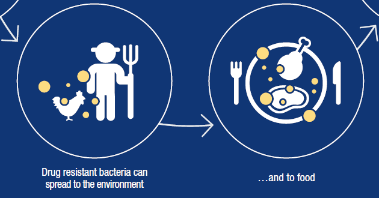

###Antimicrobial Resistance

<figure>
  

  <figcaption> Image source: [WHO](https://www.who.int/antimicrobial-resistance/en/) 
  </figcaption>
</figure>

###Study background

Antimicrobial resistance (AMR or AR) is the ability of a microbe to resist the effects of medication that once could successfully treat the microbe. Surveillance of AMR has received plenty of attention for its close relevance to food safety.  

###Statistical modeling

...

###Publication

...

*To be updated after paper being published.