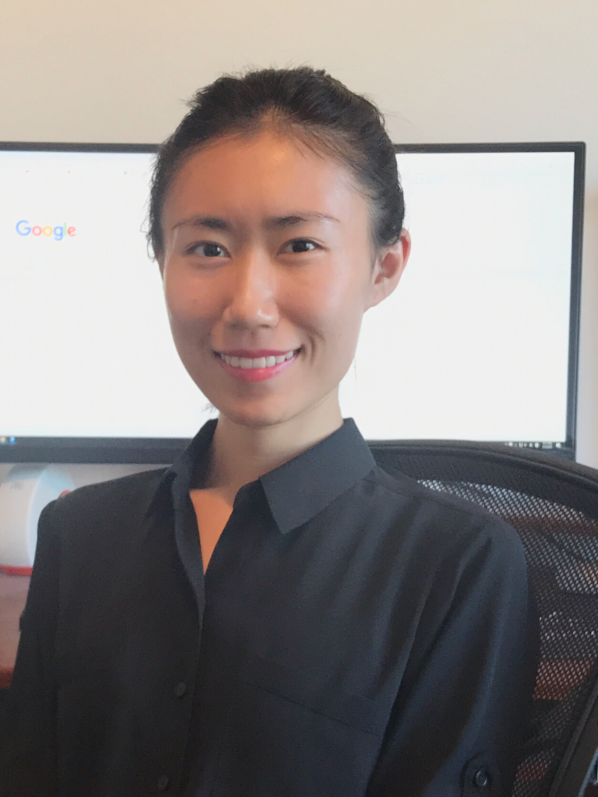

<link rel="stylesheet" href="styles.css" type="text/css">

I am a Ph.D. student in [Department of Statistics](https://www.stat.iastate.edu/) at [Iowa state University](https://www.iastate.edu/), supervised by [Dr. Chong Wang](https://chwang.public.iastate.edu/homepage.html) and [Dr. Annette O'Connor](https://vetmed.iastate.edu/users/oconnor). I received my Bachelor's Degree in Statistics from [Shanghai University of Finance and Economics](http://english.sufe.edu.cn/). My research interests include Statistical Modeling, Bayesian Analysis, Applied Statistics in Veterinary Medicine, Deep Machine Learning. 

I have been working as a Research Assistant since 2016. My job is to build statistical models and develop algorithms to solve problems from Education and Veterinary Science. I am also a statistical consultant for [College of Veterinary Medicine](https://vetmed.iastate.edu/) at ISU. I love to work with the veterinarians and help them with their data analysis. 

I serve as the Vice President of [Iowa STAT-ers](https://www.stuorg.iastate.edu/site/stat-ers) since 2018, and feel proud to be able to promote social and academic advancement in the field of statistics for graduate students at Iowa State University.

Additionally, I am a big fan of yoga, movies, and [Shiba-Inu](https://en.wikipedia.org/wiki/Shiba_Inu). 

